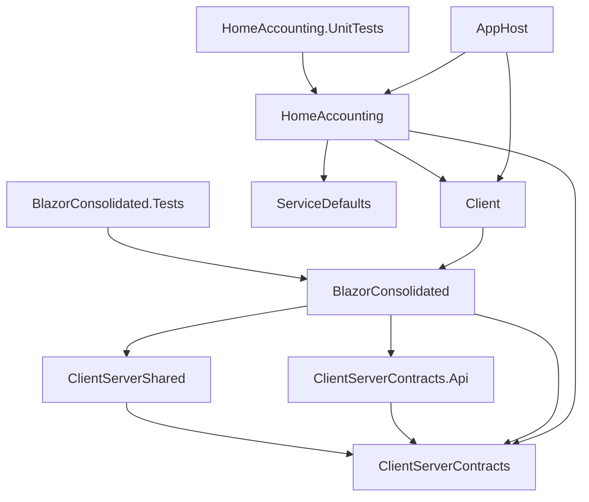

# Архитектура HomeAccounting

## Подход

HomeAccounting — модульный монолит в одном csproj (`HomeAccounting`). Бэкенд организован по bounded context'ам (неймспейсы-модули) и вертикальным срезам (один use case — одна папка). Подход вдохновлён [evolutionary-architecture-by-example](https://github.com/evolutionary-architecture/evolutionary-architecture-by-example), Chapter 1.

Подробнее о причинах выбора:
- [ADR-0001: Модульный монолит](../decisions/0001-modular-monolith.md)
- [ADR-0002: Вертикальные срезы](../decisions/0002-vertical-slices.md)

## Стек технологий

| Область | Технологии |
|---|---|
| Оркестрация | .NET Aspire |
| Backend | ASP.NET Core, Minimal API, Mediator (CQRS) |
| Frontend | Blazor WebAssembly, MudBlazor |
| Персистентность | EF Core, PostgreSQL |
| API-клиенты | Refit |
| Аутентификация | JWT Bearer, ASP.NET Core Identity |
| Валидация | FluentValidation |
| Логирование | Serilog |
| API-документация | Scalar |
| QR-коды | ZXing.Net, SkiaSharp |
| Тесты | xUnit |

## Структура solution

### Актуальные проекты

| Проект | Тип | Назначение |
|---|---|---|
| **AppHost** | Exe | .NET Aspire AppHost — оркестрация: PostgreSQL, PgAdmin, YARP reverse proxy |
| **HomeAccounting** | Web | ASP.NET Core бэкенд: Minimal API endpoints, EF Core, бизнес-логика |
| **Client** | Blazor WASM | Тонкая точка входа, ссылается на BlazorConsolidated |
| **BlazorConsolidated** | Razor Library | Blazor UI: компоненты, страницы, Refit-клиенты, авторизация |
| **ClientServerContracts** | Library | Shared DTO: запросы, ответы, общие типы между клиентом и сервером |
| **ClientServerContracts.Api** | Library | Refit-интерфейсы API-клиентов |
| **ClientServerShared** | Library | Общая логика: валидация, QR, даты, results, Mediator extensions |
| **ServiceDefaults** | Shared | Aspire service defaults: health checks, OpenTelemetry |
| **HomeAccounting.UnitTests** | Test | Unit-тесты бэкенда |
| **BlazorConsolidated.Tests** | Test | Тесты Blazor-компонентов |

### Граф зависимостей



## Модули бэкенда

Код бэкенда (`HomeAccounting`) разделён на модули по bounded context'ам:

| Модуль | Документация |
|---|---|
| `HomeAccounting.Budgets` | [Budgets](../modules/budgets.md) |
| `HomeAccounting.Users` | [Users](../modules/users.md) |
| `HomeAccounting.Categories` | [Categories](../modules/categories.md) |
| `HomeAccounting.ReceiptProcessing` | [Receipt Processing](../modules/receipt-processing.md) |
| `HomeAccounting.Common` | Общая инфраструктура: пагинация, фильтрация, event bus, базовые типы |

Эндпоинты справочника уникальных названий товаров (`/api/products`, `/api/products/csv`) реализованы в модуле Budgets; отдельного модуля Products в бэкенде нет.

## Вертикальные срезы

Каждый use case — отдельная папка внутри модуля:

```
HomeAccounting/
  Budgets/
    CreateBudget/
      CreateBudgetEndpoint.cs
      CreateBudgetRequest.cs
    AddManualSpending/
      ...
    GetReceipts/
      ...
  Users/
    Login/
      LoginEndpoint.cs
      ...
    Register/
      ...
```

В папке use case находятся: endpoint, запрос/ответ, при необходимости — обработчик и сервисы сценария.

## Инфраструктурные паттерны

### Event Bus

In-memory event bus для интеграционных событий между модулями.

- `IEventBus.PublishAsync<TEvent>()` → `InMemoryEventBus` → `IInMemoryMessageQueue`
- `IntegrationEventsProcessingJob` (BackgroundService) забирает события из очереди и публикует через Mediator
- Обработчики (`INotificationHandler<T>`) реагируют на события

### Пагинация и фильтрация

Общий механизм в `HomeAccounting.Common.Application.Paging`:

- `Filter<TField>` — фильтр с операторами (Eq, Ne, Gt, Lt, Contains, StartsWith, ...)
- `Sorting<TField>` — сортировка
- `PagingQuery` — пагинация (Take, Skip)
- Expression trees для применения фильтров к IQueryable

