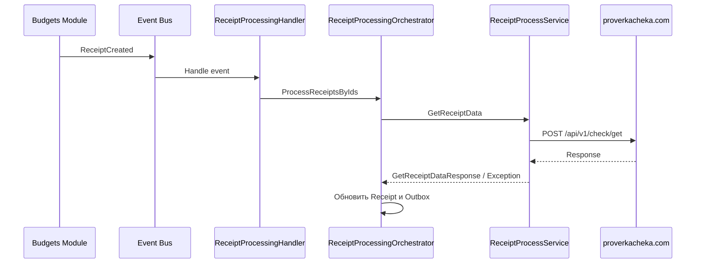

# Модуль Receipt Processing

**Пространство имён:** `HomeAccounting.ReceiptProcessing`

## Назначение

Интеграция с внешним сервисом ФНС для получения данных чека по фискальным реквизитам. Модуль инкапсулирует работу с внешним API, обработку ошибок и retry-логику.

## Архитектура интеграции

## Ключевые интерфейсы

### IReceiptProcessService

Контракт интеграции, через который модуль Budgets взаимодействует с ReceiptProcessing.

- **Вход:** `GetReceiptDataRequest` (фискальные данные чека: ФД, ФН, ФП, сумма, дата)
- **Выход:** `GetReceiptDataResponse` (место покупки, список товаров)

### ICheckService (Refit)

Refit-клиент для внешнего API `proverkacheka.com`.

- `POST https://proverkacheka.com/api/v1/check/get`
- Тело: URL-encoded фискальные данные

## Обработка ошибок

Ошибки от ФНС делятся на два типа:

### Retriable (повторяемые)

- `DataNotReceivedYetProcessException` — данные чека ещё не получены ФНС
- `NumberOfRequestsExceededProcessException` — превышен лимит запросов
- `WaitingBeforeRepeatRequestProcessException` — нужно подождать перед повторным запросом

### Terminal (терминальные)

- `IncorrectReceiptProcessException` — некорректные фискальные данные
- `OtherReceiptProcessException` — прочие ошибки API
- `UnknownReceiptProcessException` — неизвестная ошибка

## Retry-логика

Управляется через `ReceiptProcessingOrchestrator` и конфигурацию `ReceiptProcessingOptions`.

### Параметры по умолчанию

| Параметр | Значение |
|---|---|
| `MaxRetries` | 5 |
| `InitialDelay` | 5 секунд |
| `BackoffMultiplier` | 2 |
| `MaxDelay` | 30 минут |

### Алгоритм

- Задержка перед следующей попыткой: `InitialDelay × BackoffMultiplier ^ attemptCount`
- Состояние хранится в `ReceiptProcessingOutboxEntry`: счётчик попыток (`AttemptCount`), время следующей попытки (`NextRetryAt`), статус.
- При достижении `MaxRetries` или терминальной ошибке — чек переводится в статус «Ошибка».

## Фоновые процессы

### ReceiptRetryWorker

`BackgroundService`, который каждые 30 секунд проверяет outbox и запускает обработку чеков, у которых наступило время retry.

### ReceiptProcessingHandler

Обработчик события `ReceiptCreated` (через Mediator `INotificationHandler`). Запускает первичную обработку нового чека.

### Цепочка обработки

1. Пользователь добавляет чек → создаётся `Receipt` и `ReceiptProcessingOutboxEntry`.
2. Публикуется событие `ReceiptCreated` через `IEventBus`.
3. `IntegrationEventsProcessingJob` забирает событие из очереди и публикует через Mediator.
4. `ReceiptProcessingHandler` обрабатывает событие, вызывает `ProcessReceiptsByIds`.
5. `ReceiptProcessingOrchestrator` вызывает `IReceiptProcessService.GetReceiptData`.
6. В случае успеха — обновляет `Receipt` (товары, место покупки, статус «Обработано»).
7. В случае retriable-ошибки — обновляет outbox (следующая попытка, счётчик).
8. В случае terminal-ошибки — статус «Ошибка», текст ошибки.

## Зависимости

- **Внешний сервис:** `proverkacheka.com` (API проверки чеков ФНС)
- **От Budgets:** используется через интерфейс `IReceiptProcessService` (Budgets является потребителем)
- **Event Bus:** для получения события `ReceiptCreated`
