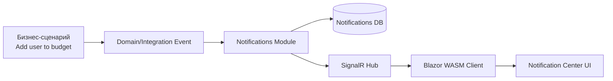
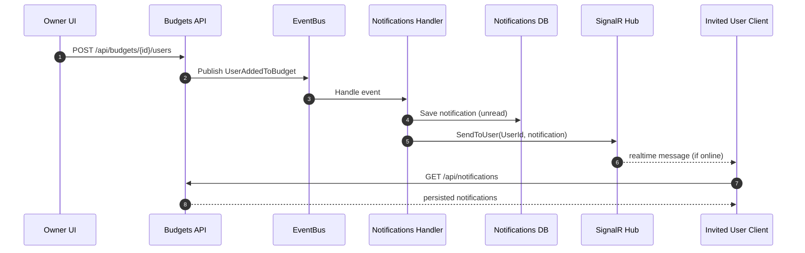
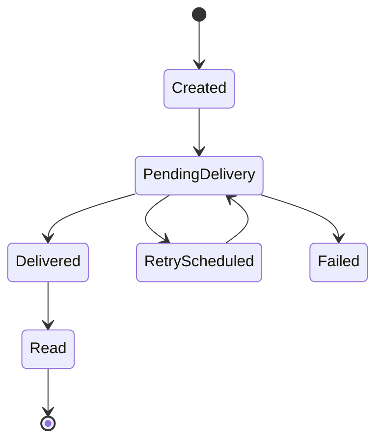

# Постановка: система уведомлений (этап 1 + задел на этап 2)

## 1. Контекст

Проект: HomeAccounting (ASP.NET Core + Blazor WASM, модульная структура).  
Задача: добавить систему уведомлений с доставкой в клиент в реальном времени.

### Вводные

1. Нужен центр уведомлений внутри приложения.
2. Уведомления должны сохраняться и быть доступны после офлайна.
3. Канал маршрутизации уведомлений: по `UserId`.
4. Первый транспорт: SignalR.
5. В будущем: email, Telegram и другие каналы.
6. Масштабирование не требуется сейчас, но архитектура должна позволять добавить его без переделки бизнес-логики.

### Текущий уровень экспертизы

1. Нет практического опыта серверной разработки с WebSocket/SignalR/long-polling.
2. Есть ограниченный опыт с Server-Sent Events только на стороне клиента.
3. Нет практического опыта построения системы уведомлений.
4. Нет практического опыта с email/telegram-каналами.

## 2. Цель

Реализовать модуль уведомлений, который:

1. Принимает доменные/интеграционные события (например, добавление пользователя в бюджет).
2. Создает и хранит уведомления в БД.
3. Доставляет уведомления в реальном времени через SignalR.
4. Предоставляет центр уведомлений в UI.
5. Расширяется новыми каналами (email/telegram) без изменения доменной логики.

## 3. Границы работ

### In scope (этап 1)

1. In-app уведомления + SignalR.
2. Хранение уведомлений в БД.
3. Центр уведомлений в UI.
4. API для чтения/пометки прочитанным.
5. Персональная доставка по `UserId`.
6. Повторные попытки доставки при временных ошибках.

### Out of scope (этап 1)

1. Фактическая отправка email/telegram.
2. Push-уведомления мобильных платформ.
3. Сложные пользовательские правила частоты/каналов уведомлений.

## 4. Функциональные требования

1. Система принимает событие бизнес-действия (пример: пользователь добавлен в бюджет).
2. Для каждого целевого пользователя создается запись уведомления в БД.
3. Уведомление содержит: `Id`, `UserId`, `Type`, `Title`, `Body`, `Payload`, `CreatedAt`, `ReadAt`, `Status`.
4. После создания выполняется попытка online-доставки через SignalR.
5. Если пользователь офлайн, уведомление не теряется и доступно в центре уведомлений после входа.
6. Клиент получает уведомления по персональному каналу `UserId`.
7. Клиент умеет:
   - получать список уведомлений (пагинация, фильтры);
   - получать счетчик непрочитанных;
   - помечать уведомление прочитанным;
   - помечать все уведомления прочитанными.
8. UI показывает badge непрочитанных и центр уведомлений.
9. Доставка имеет статусы и retry-политику.
10. Архитектура поддерживает подключение новых каналов через общий интерфейс отправителя.
11. Все операции логируются и трассируются.
12. Доступ к уведомлениям строго ограничен владельцем (`UserId` из JWT).

## 5. Визуализация

## 6. Четкий результат (критерии приемки)

1. При добавлении пользователя в бюджет создается уведомление в БД.
2. Если пользователь онлайн, уведомление приходит в UI без обновления страницы.
3. Если пользователь офлайн, после входа видит уведомление в центре.
4. Работают API: список, unread count, mark as read, mark all as read.
5. Badge непрочитанных обновляется в UI.
6. Доставка идет по `UserId`; пользователь не видит чужие уведомления.
7. Добавлен интерфейс канала доставки и реализация для SignalR.
8. Подготовлены точки расширения для email/telegram.

## 7. Декомпозиция

1. Проектирование архитектуры и контрактов.
2. Модель данных уведомлений и миграции БД.
3. Серверная интеграция SignalR (Hub + auth).
4. Интеграция с бизнес-событиями (Budgets -> Notifications).
5. API центра уведомлений.
6. Клиентский SignalR-сервис и состояние уведомлений.
7. UI центра уведомлений и badge.
8. Retry-доставка, логирование, трассировка, ошибки.
9. Тестирование (unit/integration/smoke).

## 8. Нефункциональные требования

1. Надежность: уведомления не теряются при офлайне клиента.
2. Безопасность: все endpoint/hub-вызовы авторизованы.
3. Наблюдаемость: логи и трейс на каждом этапе доставки.
4. Расширяемость: добавление нового канала без изменения бизнес-сценариев.

## 9. Риски

1. Ошибки авторизации SignalR с JWT в Blazor WASM.
2. Дубли уведомлений при повторной обработке событий.
3. Рост таблицы уведомлений без политики архивирования/очистки.
4. Сложность диагностики realtime-проблем без достаточных метрик.

## 10. Ресурсы для изучения

1. SignalR overview: https://learn.microsoft.com/aspnet/core/signalr/introduction
2. SignalR hubs: https://learn.microsoft.com/aspnet/core/signalr/hubs
3. SignalR auth/authz: https://learn.microsoft.com/aspnet/core/signalr/authn-and-authz
4. BackgroundService: https://learn.microsoft.com/aspnet/core/fundamentals/host/hosted-services
5. EF Core modeling: https://learn.microsoft.com/ef/core/modeling/
6. EF Core indexes: https://learn.microsoft.com/ef/core/modeling/indexes
7. Minimal APIs: https://learn.microsoft.com/aspnet/core/fundamentals/minimal-apis
8. Telegram Bot API (на будущее): https://core.telegram.org/bots/api
9. SendGrid API (на будущее): https://docs.sendgrid.com/for-developers/sending-email/api-getting-started
